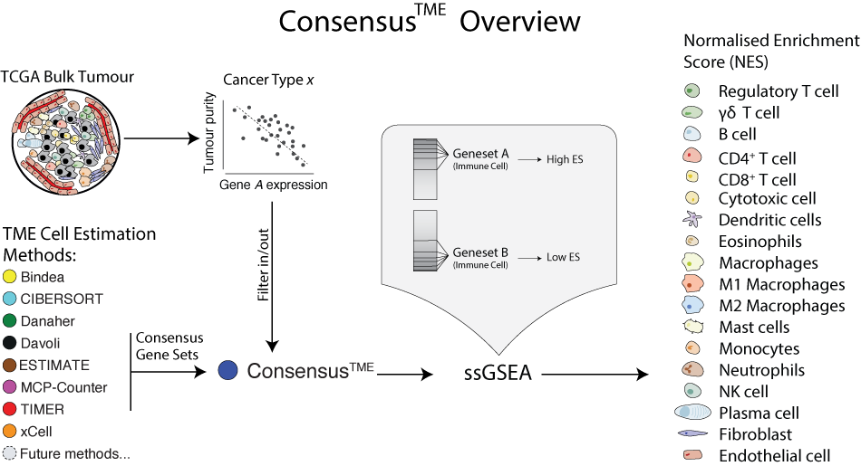

# Consensus<sup>TME</sup>: Tumour microenvironment cell estimation


The `ConsensusTME` package provides a integrative tool for `R` that uses a consensus approach to generating cancer specific signatures for multiple cell types found within the tumour microenvironment.

These consensus gene sets are then used within a ssGSEA framework to provide normalised enrichment scores for each of the cell types representing the relative abundance of cell types across multiple samples.

<p align="center">
  
</p>

# Installation

The recommended installation for the `R` package is to use the `install_github` function from the `devtools` package.

```r
install.packages("devtools")
devtools::install_github("cansysbio/ConsensusTME")
```

# Usage

### Cell Type Estimation

```r
library(ConsensusTME)

bulkExpMatrix <- as.matrix(read.delim(bulkGeneExpression.txt, row.names = 1))

ConsensusTME::consensusTMEAnalysis(bulkExpMatrix, cancer = "OV", statMethod = "ssgsea")
```
Example shows running Consensus<sup>TME</sup> for ovarian samples where `bulkExpMatrix` is a numerical matrix
with [HUGO gene symbols](https://www.genenames.org/) as row names.

Currently Consensus<sup>TME</sup> can be run for the following
[TCGA cancer types](https://gdc.cancer.gov/resources-tcga-users/tcga-code-tables/tcga-study-abbreviations) viewable through `ConsensusTME::cancerAll`:

```r
ACC BLCA BRCA CESC CHOL COAD DLBC ESCA GBM HNSC KICH KIRC KIRP LGG LIHC LUAD
LUSC MESO OV PAAD PCPG PRAD READ SARC SKCM STAD TGCT THCA THYM UCEC UCS UVM
```
The `statMethod` argument gives the option to run Consensus<sup>TME</sup> gene sets with the following statistical frameworks:

```r
ssgsea singScore gsva plage plage zscore
```
Further information can be found in the documentation `?consensusTMEAnalysis`

### Run Gene Set Enrichment Separately

To use the same statistical framework as Consensus<sup>TME</sup> with a chosen signature from the consensus compendium.

```r
bindeaGeneSet <- ConsensusTME::methodSignatures$Bindea

ConsensusTME::geneSetEnrichment(bulkExpMatrix, bindeaGeneSet)

```

### Generate Consensus<sup>TME</sup> Gene Sets

Consensus<sup>TME</sup> gene sets can be generated for other uses. <b>N.B.</b> These gene sets are curated to be good signatures for immune cells within the tumour microenvironment. For immune cells in a different biological context other signatures may be more appropriate.

Pre-processed Consensus<sup>TME</sup> gene sets can  be accessed with `ConsensusTME::consensusGeneSets`

```r
rawMethodSignatures <- ConsensusTME::methodSignatures

matchedSigs <- ConsensusTME::matchGeneSigs(rawMethodSignatures)

ConsensusTME::buildConsensusGenes(matchedSigs)

```

# Notes

- It is important to note that results generated in this way will provide quantification of cell types that are relative across samples rather than across cell types.

- Consensus<sup>TME</sup> gene sets have been made to be cancer specific, if analysis is aimed at healthy tissue or PBMCs better results may be obtained by using alternative gene sets or methodologies.

- Consensus<sup>TME</sup> is by design an evolvable tool. As more gene sets and signature matrices are made available we will assess whether including will improve performance and release a new version subsequently.

- Please contact any of the authors if you believe there are signatures or approaches that Consensus<sup>TME</sup> would benefit from including.


# Publication

This manuscript is published in Cancer Research "Comprehensive Benchmarking and Integration of Tumor Microenvironment Cell Estimation Methods"

https://aacrjournals.org/cancerres/article/79/24/6238/639705/Comprehensive-Benchmarking-and-Integration-of
